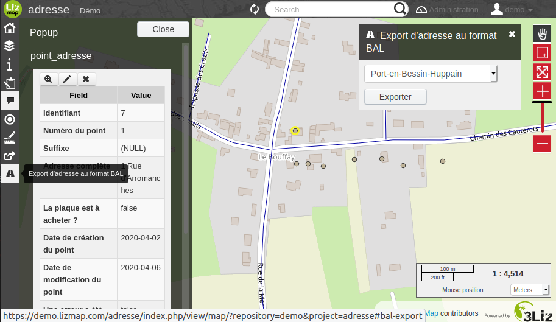

## Gestion des adresses

* Dépôt plugin QGIS : https://github.com/3liz/qgis-gestion_base_adresse-plugin/releases/latest/download/plugins.xml
* Documentation de la base de données : https://3liz.github.io/qgis-gestion_base_adresse-plugin/

## Tests

Pour lancer l'installation de la base de données en utilisant les migrations, il faut utiliser la variable d'environnement `TEST_DATABASE_INSTALL_ADRESSE` = `0.2.3`.

### Credits

letter box by Line Icons Pro from the Noun Project
