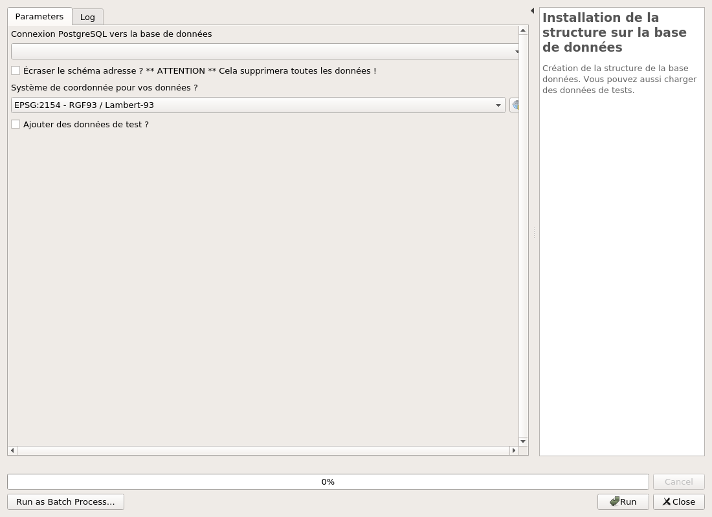
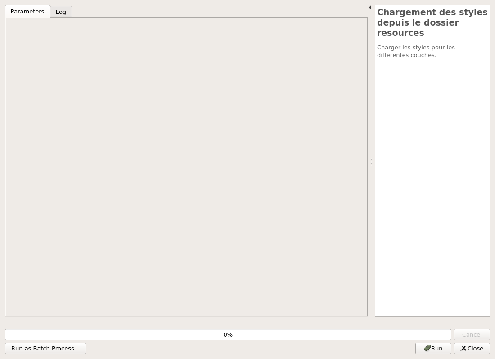

# Configuration

Il est nécessaire de suivre les étapes dans l'ordre afin de configurer le projet QGIS avec succès.

## Liste des scripts

Voici les différents scripts présents dans le plugin accessible via la boîte à outils.

## Structuration de la base de données 

### Installation de la base

Vous allez utiliser ce script principalement lors de la première utilisation du plugin dans un nouveau 
projet adresse. S'il s'agit d'une nouvelle version du plugin qui impacte la base de données vous utiliserez 
le prochain script.

Assurez-vous d'avoir au préalable créé une connexion vers votre base de données dans QGIS.
Pour cette première phase on utilise l'algorithme **Installation de la structure sur la base de données** 
présent dans l'onglet **Structure** de la [liste des différents scripts du plugin](#liste-des-scripts).

Dans un premier temps vous devez sélectionner votre connexion à la base de données.
Ensuite vous avez deux cases à cocher qui vous permettent :
 * d'écraser le schéma adresse si vous en possédez déjà un 
 * d'ajouter des données de test fournies par le plugin

Si vous décidez d'écraser le schéma et que vous souhaitez garder vos données, veillez à faire une sauvegarde 
en amont.

### Mise à jour de la base

Si vous disposez déjà d'une base de données adresse et qu'une nouvelle version est disponible, il faut 
utiliser le script **Mise à jour de la structure de la base** pour faire la mise à jour.

Script simple d'utilisation il suffit de renseigner la connexion à la base de données puis de cocher la case 
pour que la mise à jour se lance lors de l'exécution.

## Configuration du Projet QGIS

### Récupération des couches nécessaires

Dans l'onglet **Données** de la [liste des différents scripts du plugin](#liste-des-scripts), il y a le 
script **Chargement des couches depuis la base** qui permet d'importer les différentes couches nécessaires dans le 
module adresse.

Pour exécuter ce script correctement il suffit de renseigner la connexion à la base de données dans le 
premier paramètre, puis le schéma qui contient les couches. En l'occurrence ici normalement le schéma 
s'appelle **adresse**.

Les couches sont donc présentes dans le projets.

| :warning:  Pour le module adresse présent sur lizmap, les noms des couches sur le projet QGIS ne doivent pas être modifié ! |
|----------------------------------|

| :memo: Si vous souhaitez un nom plus explicite ou plus adapté pour les couches, vous pourrais dans l'étape [Configuration pour Lizmap](#Configuration-pour-Lizmap) ci-après, modifier le titre des couches.|
|:--------------|

### Application des styles

Juste en dessous du script précédent il y a celui qui se nomme **Chargement des styles depuis le dossier resources** 
qui permet d'appliquer un style ainsi que d'appliquer les paramètres nécessaires aux couches ayant une géométrie.

Il ne contient pas de paramètres, il suffit juste de l'exécuter.

### Configurer les variables de projet

On trouve maintenant le script **Configuration du projet** présent dans l'onglet **Outils** de la [liste des différents scripts du plugin](#liste-des-scripts).

Celui-ci nous permet de configurer en variable globale dans le projet, les couches importantes qui concerne 
les voies et les adresses.

Ce script contient 2 paramètres, dans l'un on y met la couche `voie` et dans l'autre on renseigne la couche `point_adresse`.

### Configuration des propriétés du projet

En haut à gauche de votre fenêtre QGIS vous trouverez le menu **Projet** dans lequel vous aurez accès aux **propriétés**.

Une fois dans la fenêtre **Propriétés du projet** vous irez dans la section **QGIS Server**, puis dans la 
partie **Capacités WFS** où vous cocherez pour les couches `voie`, `v_point_adresse` et `document` la case de la colonne 
**Publié**.

### Configuration pour Lizmap

Dernière étape pour avoir un projet bien configuré il s'agit de la partie Lizmap. Il faut ouvrir le plugin. 
Nous, on s'occupera uniquement des sections **Couches** et **Éditions  de couche**, pour le reste en ce qui 
concerne les **Options de carte** ou les **Fonds** vous pouvez configurer selon vos besoins et envies.

Pour ce qui est des couches, pour celles sans géométrie il n'y a rien à faire alors que celles avec géométrie 
dans la partie **Légende** il faut cocher les cases **Cochée ?** et **Afficher dans la légende**. 
Puis pour les couches `v_point_adresse` et `voie` on coche la case **Popup**.

Pour ce qui est de la configuration de l'édition comme on le voie sur l'image ci-dessous il suffit d'ajouter 
les couches auxquelles on permet l'édition. Pour le module Adresse cela concerne uniquement `voie`, `v_point_adresse` 
et `document`. Pour pouvoir ajouter une couche à l'édition il suffit de cliquer sur le bouton représentant une 
croix de couleur verte.

### Fonctionnalité des certificats de numérotation

Pour ajouter cette fonctionnalité il suffit d'utiliser l'algorithme 
**Mise en place des données pour certificat de numérotation**. Il dispose de 2 paramètres :

* La connexion à la base de données
* Le schéma de données où sont les données du cadastre

Une fois utilisé, de nouvelles couches apparaîtrons dans le projet. Il restera donc à enregistrer le projet
puis ouvrir le plugin Lizmap et cliquer sur le bouton appliquer pour comptabiliser les couches dans la
config Lizmap.

___

Voilà maintenant il ne vous reste qu'à configurer votre un projet dans Lizmap web client. Vous pouvez vous 
aider de la [Documentation](https://docs.lizmap.com/next/fr/publish/lizmap_configuration.html) de Lizmap.

Vous pouvez ensuite lire la documentation du [module Adresse](./../module-lizmap/user-guide.md).
