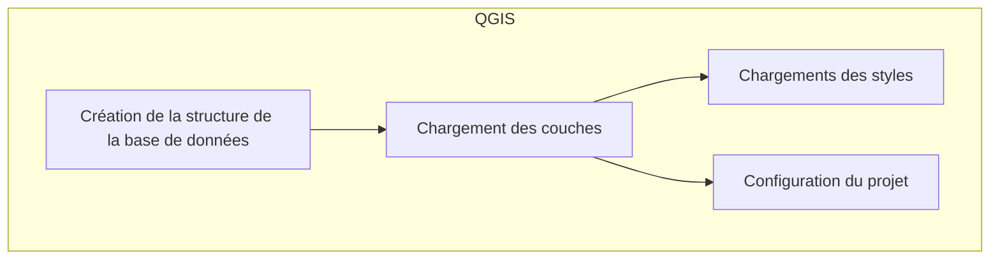
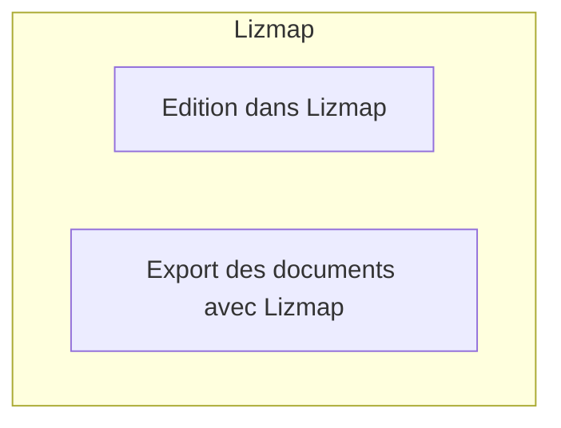

---
hide:
  - navigation
  - toc
---

# Gestion d'une base adresse avec QGIS et Lizmap

## Diagrammes

Démo du module web sur [demo.lizmap.com](https://demo.lizmap.com/adresse/index.php/view/map/?repository=demo&project=adresse)

