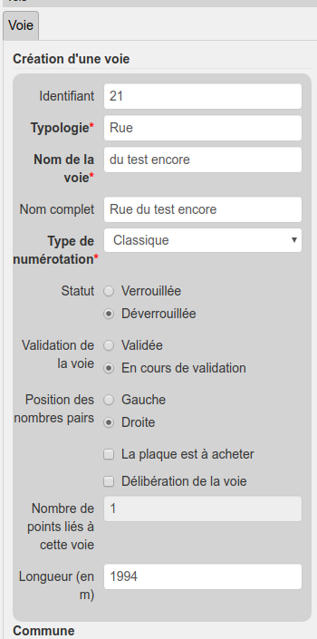

# Module Lizmap

## Spécificité lors de l'édition

Pour pouvoir éditer une adresse il y a plusieurs choses à prendre en compte. Tout commence avec la couche 
`voie` ou comme le montre l'image ci-dessous il y a deux styles différents. **Bleu** pour une voie 
**vérouillée** et **Rouge** pour une voie **déverrouillée**.

Lorsqu'on souhaite créer une adresse et en l'occurrence éditer la couche `point_adresse` il faut que la voie 
qui concerne cette adresse soit en mode **déverrouillée**.

Pour ce faire on entre en mode édition avec la voie concernée par l'adresse et comme on l'aperçoit sur 
l'image ci-dessous, il y a un paramètre **Statut** en bouton radio où l'on peut lui attribuer la valeur 
`Verrouillée` ou bien la valeur `Déverrouillée`.

Maintenant que la voie sur laquelle je compte travailler est déverrouillée je peux ajouter l'adresse. Il 
suffit d'entrer en edition avec la couche `point_adresse` puis de placer le point la où se situe l'adresse. 
Après ça une proposition concernant le numéro d'adresse est générée automatiquement. Cette génération 
automatique prend en compte le sens de la voie, le côté de la voie ou l'on se situe, le type de numérotation 
(classique ou métrique), si l'on a inversé le sens de numérotation ou non et les points déjà présents. La 
voie que vous avez déverrouillée sera aussi automatiquement prix en compte pour votre adresse.

Exemple : sur l'image ci-dessous, la voie à laquelle j'ajoute une adresse, son sens va de haut en bas. Sa 
numérotation est classique et je me situe donc à droite. Son sens de numérotation n'est pas inversé donc il 
est censé générer un numéro pair. Il n'y a pas d'adresse présente à droite donc il me donne le numéro 2 
(premier nombre pair). Bien sûr vous pouvez modifier le numéro si vous en avez besoin.

## Export de document

Comme on le voit ci-dessous, le module ajoute un mini-dock. Il est représenté dans le menu par une icône de 
route (dernier élément du menu). Sur ce dock on y trouve un menu de téléchargement des documents pour la 
gestion des voie et adresse. Il y a :
* l'export BAL qui est un export CSV des adresses au format BAL
* l'export des voies à délibérer
* l'export SNA.

 

Sur l'image du minidock ci-dessus on aperçoit une case à cocher **Dernière délibération**. Cela signifie
que l'on a la possibilité, dans l'export SNA, d'y intégrer soit la dernière délibération soit toutes les
délibérations de la commune.

Voici un exemple d'export BAL :

