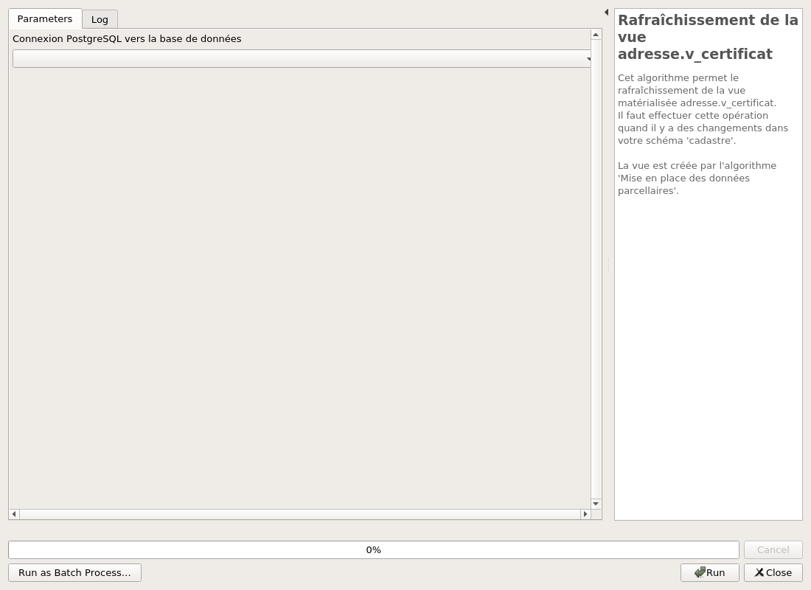

---
hide:
  - navigation
---

# Processing

## Outils

### Configuration du projet

La configuration ajoute les variables concernant le nom des couches dans le projet.

#### Parameters

| ID | Description | Type | Info | Required | Advanced | Option |
|:-:|:-:|:-:|:-:|:-:|:-:|:-:|
STREET_LAYER|Voirie|VectorLayer||✓||Type: TypeVectorLine  |
ADDRESS_LAYER|Point adresse|VectorLayer||✓||Type: TypeVectorPoint  |

#### Outputs

| ID | Description | Type | Info |
|:-:|:-:|:-:|:-:|
No output

***

## Structure des données

### Installation de la structure sur la base de données

Création de la structure de la base données. Vous pouvez aussi charger des données de tests.

#### Parameters

| ID | Description | Type | Info | Required | Advanced | Option |
|:-:|:-:|:-:|:-:|:-:|:-:|:-:|
CONNECTION_NAME|Connexion PostgreSQL vers la base de données|String|Nom de la connexion dans QGIS pour se connecter à la base de données|✓|||
OVERRIDE|Écraser le schéma adresse ? ** ATTENTION ** Cela supprimera toutes les données !|Boolean||✓|||
SRID|Système de coordonnée pour vos données ?|Crs||✓||Default: EPSG:2154   |
ADD_TEST_DATA|Ajouter des données de test ?|Boolean||✓|||

#### Outputs

| ID | Description | Type | Info |
|:-:|:-:|:-:|:-:|
OUTPUT_STATUS|Output status|Number||
OUTPUT_STRING|Output message|String||
DATABASE_VERSION|Database version|String||

***

### Mise à jour de la structure de la base

Mise à jour de la base de données suite à une nouvelle version de l'extension.

#### Parameters

| ID | Description | Type | Info | Required | Advanced | Option |
|:-:|:-:|:-:|:-:|:-:|:-:|:-:|
CONNECTION_NAME|Connexion PostgreSQL vers la base de données|String|Nom de la connexion dans QGIS pour se connecter à la base de données|✓|||
RUN_MIGRATIONS|Cocher cette option pour lancer la mise-à-jour.|Boolean||✓|||
SRID|Projection des géométries|Crs||✓||Default: EPSG:2154   |

#### Outputs

| ID | Description | Type | Info |
|:-:|:-:|:-:|:-:|
OUTPUT_STATUS|Output status|Number||
OUTPUT_STRING|Output message|String||

***

## Données

### Mise en place des données parcellaires pour les certificats de numérotation

Ajout des données parcellaire et création des vues pour les certificats de numérotation.

#### Parameters

| ID | Description | Type | Info | Required | Advanced | Option |
|:-:|:-:|:-:|:-:|:-:|:-:|:-:|
CONNECTION_NAME|Connexion PostgreSQL vers la base de données|String|Base de données de destination|✓|||
SCHEMA|Schéma des données du cadastre|String|Nom du schéma des données cadastre|||Default: cadastre   |
TRUNCATE_PARCELLE|Mise à jour de la table parcelle|Boolean||✓|||

#### Outputs

| ID | Description | Type | Info |
|:-:|:-:|:-:|:-:|
OUTPUT|Couches de sortie|MultipleLayers||
OUTPUT MSG|Message de sortie|String||

***

### Chargement des couches depuis la base

Charger toutes les couches de la base de données.

#### Parameters

| ID | Description | Type | Info | Required | Advanced | Option |
|:-:|:-:|:-:|:-:|:-:|:-:|:-:|
CONNECTION_NAME|Connexion PostgreSQL vers la base de données|String|Base de données de destination|✓|||
SCHEMA|Schéma|String|Nom du schéma des données adresses|||Default: adresse   |

#### Outputs

| ID | Description | Type | Info |
|:-:|:-:|:-:|:-:|
OUTPUT|Couches de sortie|MultipleLayers||
OUTPUT MSG|Message de sortie|String||

***

### Chargement des styles depuis le dossier resources

Charger les styles pour les différentes couches.

#### Parameters

| ID | Description | Type | Info | Required | Advanced | Option |
|:-:|:-:|:-:|:-:|:-:|:-:|:-:|
INPUT|Champ qui ne sert à rien !|String|||||

#### Outputs

| ID | Description | Type | Info |
|:-:|:-:|:-:|:-:|
OUTPUT MSG|Message de sortie|String||

***

### Rafraîchissement de la vue adresse.v_certificat

Cet algorithme permet le rafraîchissement de la vue matérialisée adresse.v_certificat. Il faut effectuer cette opération quand il y a des changements dans votre schéma 'cadastre'.  La vue est créée par l'algorithme 'Mise en place des données parcellaires'.

#### Parameters

| ID | Description | Type | Info | Required | Advanced | Option |
|:-:|:-:|:-:|:-:|:-:|:-:|:-:|
CONNECTION_NAME|Connexion PostgreSQL vers la base de données|String|Base de données de vos schémas 'cadastre' et 'adresse'|✓|||

#### Outputs

| ID | Description | Type | Info |
|:-:|:-:|:-:|:-:|
No output

***

