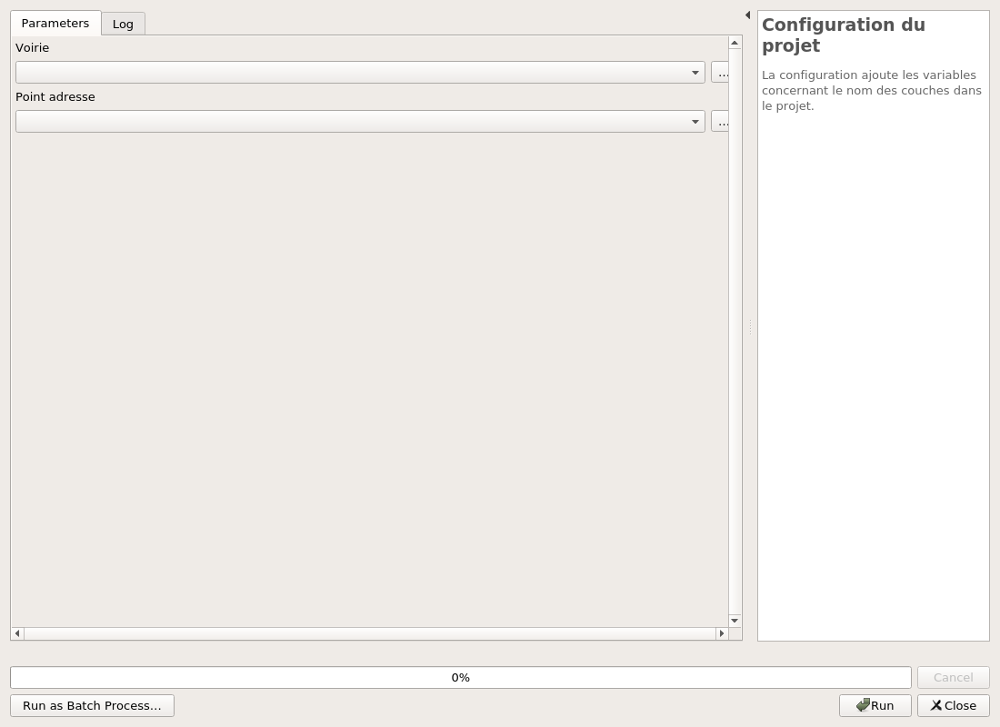
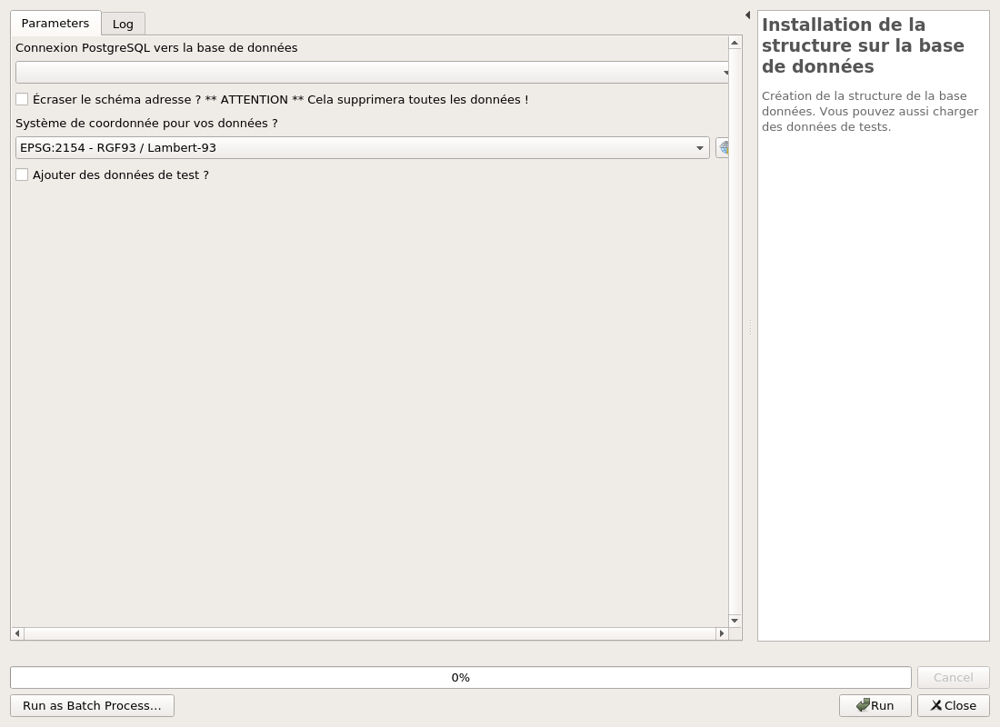
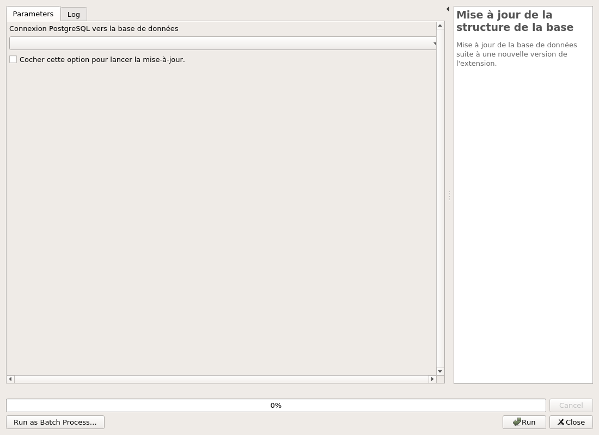
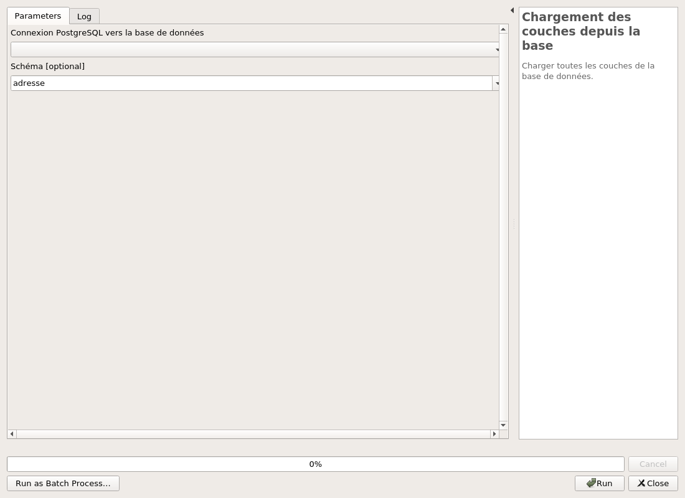
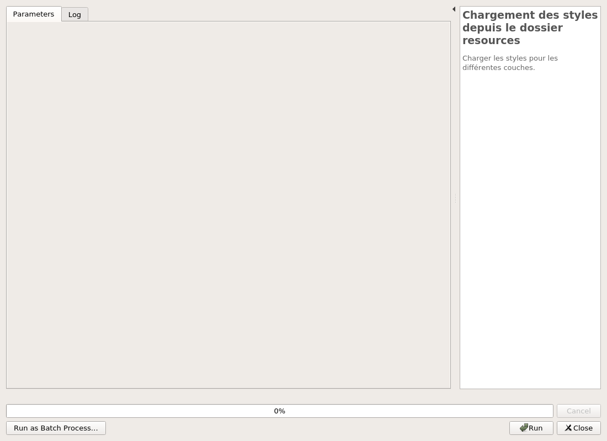

---
Title: Gestion des adresses
Favicon: ../icon.png
...

[TOC]

# Gestion des adresses

## Outils

### Configuration du projet

La configuration ajoute les variables concernant le nom des couches dans le projet.

#### Parameters

| ID | Description | Type | Info | Required | Advanced |
|:-:|:-:|:-:|:-:|:-:|:-:|
ADDRESS_LAYER|Voirie|VectorLayer||✓||
STREET_LAYER|Point adresse|VectorLayer||✓||

#### Outputs

| ID | Description | Type | Info |
|:-:|:-:|:-:|:-:|

***

## Structure

### Installation de la structure sur la base de données

Création de la structure de la base données. Vous pouvez aussi charger des données de tests.

#### Parameters

| ID | Description | Type | Info | Required | Advanced |
|:-:|:-:|:-:|:-:|:-:|:-:|
CONNECTION_NAME|Connexion PostgreSQL vers la base de données|String||✓||
OVERRIDE|Écraser le schéma adresse ? ** ATTENTION ** Cela supprimera toutes les données !|Boolean||✓||
ADD_TEST_DATA|Ajouter des données de test ?|Boolean||✓||

#### Outputs

| ID | Description | Type | Info |
|:-:|:-:|:-:|:-:|
OUTPUT_STATUS|Output status|Number||
OUTPUT_STRING|Output message|String||

***

### Mise à jour de la structure de la base

Mise à jour de la base de données suite à une nouvelle version de l'extension.

#### Parameters

| ID | Description | Type | Info | Required | Advanced |
|:-:|:-:|:-:|:-:|:-:|:-:|
CONNECTION_NAME|Connexion PostgreSQL vers la base de données|String||✓||
RUN_MIGRATIONS|Cocher cette option pour lancer la mise-à-jour.|Boolean||✓||

#### Outputs

| ID | Description | Type | Info |
|:-:|:-:|:-:|:-:|
OUTPUT_STATUS|Output status|Number||
OUTPUT_STRING|Output message|String||

***

## Données

### Chargement des couches depuis la base

Charger toutes les couches de la base de données.

#### Parameters

| ID | Description | Type | Info | Required | Advanced |
|:-:|:-:|:-:|:-:|:-:|:-:|
DATABASE|Connexion à la base de données|String||✓||
SCHEMA|Schéma|String||||

#### Outputs

| ID | Description | Type | Info |
|:-:|:-:|:-:|:-:|
OUTPUT|Couches de sortie|MultipleLayers||
OUTPUT MSG|Message de sortie|String||

***

### Chargement des styles depuis le dossier resources

Charger les styles pour les différentes couches.

#### Parameters

| ID | Description | Type | Info | Required | Advanced |
|:-:|:-:|:-:|:-:|:-:|:-:|
INPUT|Champ qui ne sert à rien !|String||||

#### Outputs

| ID | Description | Type | Info |
|:-:|:-:|:-:|:-:|
OUTPUT MSG|Message de sortie|String||

***

